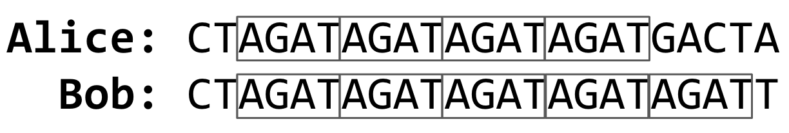

# DNA

## Problem to Solve
DNA, the carrier of genetic information in living things, has been used in criminal justice for decades. But how, exactly, does DNA profiling work? Given a sequence of DNA, how can forensic investigators identify to whom it belongs?

In a file called dna.py in a folder called dna, implement a program that identifies to whom a sequence of DNA belongs.

## Background
DNA is really just a sequence of molecules called nucleotides, arranged into a particular shape (a double helix). Every human cell has billions of nucleotides arranged in sequence. Each nucleotide of DNA contains one of four different bases: adenine (A), cytosine (C), guanine (G), or thymine (T). Some portions of this sequence (i.e., genome) are the same, or at least very similar, across almost all humans, but other portions of the sequence have a higher genetic diversity and thus vary more across the population.

One place where DNA tends to have high genetic diversity is in Short Tandem Repeats (STRs). An STR is a short sequence of DNA bases that tends to repeat consecutively numerous times at specific locations inside of a person’s DNA. The number of times any particular STR repeats varies a lot among individuals. In the DNA samples below, for example, Alice has the STR AGAT repeated four times in her DNA, while Bob has the same STR repeated five times.



Using multiple STRs, rather than just one, can improve the accuracy of DNA profiling. If the probability that two people have the same number of repeats for a single STR is 5%, and the analyst looks at 10 different STRs, then the probability that two DNA samples match purely by chance is about 1 in 1 quadrillion (assuming all STRs are independent of each other). So if two DNA samples match in the number of repeats for each of the STRs, the analyst can be pretty confident they came from the same person. CODIS, the FBI’s DNA database, uses 20 different STRs as part of its DNA profiling process.

What might such a DNA database look like? Well, in its simplest form, you could imagine formatting a DNA database as a CSV file, wherein each row corresponds to an individual, and each column corresponds to a particular STR.

```powershell
name,AGAT,AATG,TATC
Alice,28,42,14
Bob,17,22,19
Charlie,36,18,25
```

The data in the above file would suggest that Alice has the sequence `AGAT` repeated 28 times consecutively somewhere in her DNA, the sequence `AATG` repeated 42 times, and `TATC` repeated 14 times. Bob, meanwhile, has those same three STRs repeated 17 times, 22 times, and 19 times, respectively. And Charlie has those same three STRs repeated 36, 18, and 25 times, respectively.

So given a sequence of DNA, how might you identify to whom it belongs? Well, imagine that you looked through the DNA sequence for the longest consecutive sequence of repeated `AGATs` and found that the longest sequence was 17 repeats long. If you then found that the longest sequence of `AATG` is 22 repeats long, and the longest sequence of `TATC` is 19 repeats long, that would provide pretty good evidence that the DNA was Bob’s. Of course, it’s also possible that once you take the counts for each of the STRs, it doesn’t match anyone in your DNA database, in which case you have no match.

In practice, since analysts know on which chromosome and at which location in the DNA an STR will be found, they can localize their search to just a narrow section of DNA. But we’ll ignore that detail for this problem.

Your task is to write a program that will take a sequence of DNA and a CSV file containing STR counts for a list of individuals and then output to whom the DNA (most likely) belongs.

## 1. Specification

- The program should require as its first command-line argument the name of a CSV file containing the STR counts for a list of individuals and should require as its second command-line argument the name of a text file containing the DNA sequence to identify.
    - If your program is executed with the incorrect number of command-line arguments, your program should print an error message of your choice (with print). If the correct number of arguments are provided, you may assume that the first argument is indeed the filename of a valid CSV file and that the second argument is the filename of a valid text file.
  
- Your program should open the CSV file and read its contents into memory.
    - You may assume that the first row of the CSV file will be the column names. The first column will be the word name and the remaining columns will be the STR sequences themselves.  
    
- Your program should open the DNA sequence and read its contents into memory.

- For each of the STRs (from the first line of the CSV file), your program should compute the longest run of consecutive repeats of the STR in the DNA sequence to identify. Notice that we’ve defined a helper function for you, longest_match, which will do just that!
If the STR counts match exactly with any of the individuals in the CSV file, your program should print out the name of the matching individual.
    - You may assume that the STR counts will not match more than one individual.
    - If the STR counts do not match exactly with any of the individuals in the CSV file, your program should print No match.

---

## 2. Program Execution Flow

```
[Command Line Input] (CSV File path, TXT File path)
        │
        ▼
[Command Line Validation] (Validates exactly 3 arguments)
        │
        ▼
[File Parsing] 
 ├── Read CSV ──► Parsed into a list of dictionaries (`database_csv`)
 └── Read TXT ──► Loaded into a memory string (`database_seq`)
        │
        ▼
[Feature Extraction] ──► Extract STR keys from CSV headers (`strs`)
        │
        ▼
[STR Computation] ──► Calculate maximum consecutive runs for each STR
        │             via `longest_match()` ──► Store in `dna_fingerprint`
        ▼
[Profile Matching] ──► Compare computed dictionary to each database row
        │
 ┌──────┴──────┐
 ▼             ▼
[Match Found] [No Match]
 │             │
 ▼             ▼
Print Name    Print "No match"
```

---

## 3. Function Analysis

### `main()`
The controller function coordinates file input/output, orchestrates parsing, initiates computation, evaluates matches, and outputs results.

#### Step 1: Command-Line Validation
```python
if len(sys.argv) != 3:
    print("Usage: python dna.py data.csv sequence.txt")
    sys.exit(1)
```
* **Logic:** Checks the size of `sys.argv`. Since `sys.argv[0]` contains the script name, a valid execution requires exactly three arguments. 
* **Failure State:** If the count is not 3, it displays the required syntax to standard output and exits execution using a status code of `1` to signify an error.

#### Step 2: Database Parsing (CSV)
```python
with open(sys.argv[1], "r") as file:
    readcsv = csv.DictReader(file)
    database_csv = list(readcsv)
```
* **Logic:** Opens the path stored in `sys.argv[1]` in read-only mode (`"r"`). 
* **Serialization:** Utilizes `csv.DictReader` to map the CSV columns dynamically to Python dictionary structures. The keys correspond to the header row values (e.g., `"name"`, `"AGATC"`, `"AATG"`). 
* **Persistence:** Casts the iterator into a concrete `list` (`database_csv`) so the records remain persistent in memory after the file context is closed.

#### Step 3: DNA Sequence Extraction (TXT)
```python
with open(sys.argv[2], "r") as file:
    database_seq = file.read()
```
* **Logic:** Opens the raw sequence file in `sys.argv[2]`. Calling `file.read()` reads the sequence as a single continuous string and binds it to `database_seq`.

#### Step 4: STR Key Extraction
```python
strs = list(database_csv[0].keys())[1:]
```
* **Logic:** Extracts the keys of the first record dictionary (`database_csv[0]`). Since the first key is always the column header `"name"`, the list slicing syntax `[1:]` is employed to omit the `"name"` element, isolating only the pure STR sequences (e.g., `["AGATC", "AATG", "TATC"]`).

#### Step 5: STR Computation Loop
```python
dna_fingerprint = {}
for s in strs:
    dna_fingerprint[s] = longest_match(database_seq, s)
```
* **Logic:** Creates an empty dictionary `dna_fingerprint` to store computed results. It iterates over every isolated STR sequence (`s`) in `strs` and invokes the helper function `longest_match` using the main DNA sequence and current STR. The resulting count is assigned to `dna_fingerprint[s]`.

#### Step 6: Profile Matching Logic
```python
for person in database_csv:
    match = True
        
    for s in strs:
        if int(person[s]) != dna_fingerprint[s]:
            match = False
            break
        
    if match:
        print(person["name"])
        return
print("No match")
```
* **Logic:** Iterates over each dictionary record (`person`) in the database.
  * **Evaluation State:** Initializes a boolean flag `match = True`.
  * **Value Comparison:** Iterates over each STR key (`s`). Because CSV database values are parsed as strings, `int(person[s])` converts the database value into an integer to match the integer returned by the `longest_match` function.
  * **Short-circuiting Mismatch:** If any database count fails to match the computed count (`dna_fingerprint[s]`), `match` is set to `False` and the inner loop terminates (`break`), skipping further comparison for that candidate.
  * **Success Condition:** If the inner loop finishes without turning `match` to `False`, the current `person["name"]` is printed to standard output, and a `return` statement exits `main()`.
  * **No Match Condition:** If the outer loop finishes checking all profiles and none match, the program prints `"No match"`.

---

### `longest_match(sequence, subsequence)`
A helper function that calculates the maximum consecutive run of a given `subsequence` (the STR) within a larger string (`sequence`).

```python
def longest_match(sequence, subsequence):
    longest_run = 0
    subsequence_length = len(subsequence)
    sequence_length = len(sequence)
```
* **Initialization:** Computes sequence boundaries and defines `longest_run = 0` to track the overall maximum consecutive run.

```python
    for i in range(sequence_length):
        count = 0
```
* **Window Scanning:** Loops over every single index `i` of the DNA sequence to evaluate consecutive repeats starting from that index.

```python
        while True:
            start = i + count * subsequence_length
            end = start + subsequence_length

            if sequence[start:end] == subsequence:
                count += 1
            else:
                break
```
* **Inner Run Counting:** Evaluates consecutive blocks starting at index `i`.
  * The scanning window indices `start` and `end` move forward dynamically based on the current streak count (`count * subsequence_length`).
  * If the slice `sequence[start:end]` matches the `subsequence`, the streak count increases by `1` and the loop repeats to check the next sequential window.
  * If the match fails or boundaries are exceeded, the `while` loop breaks.

```python
        longest_run = max(longest_run, count)
    return longest_run
```
* **Comparison & Return:** Keeps the maximum streak recorded so far by comparing the current local streak `count` to the global `longest_run` using `max()`. After checking every index `i`, it returns `longest_run`.

---

## 4. Key Implementation details

* **Scope and Persistence:** By using `list(readcsv)` within the file system context block (`with open`), file data is copied to the program's global memory, allowing the files to be safely closed before heavy processing begins.
* **Implicit Data Slicing:** Rather than manually mapping or hardcoding columns, using `list(database_csv[0].keys())[1:]` ensures compatibility with any sized CSV database (large or small) containing different STR counts.
* **Short-Circuit Verification:** The use of `break` within nested loops minimizes redundant computations, terminating checks immediately when a profile mismatch is discovered.