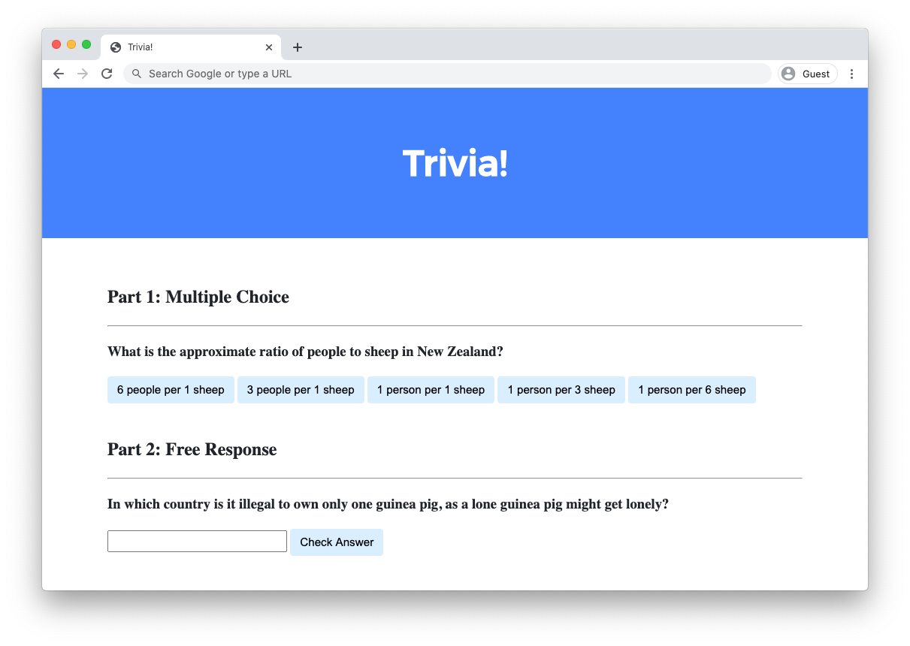

# **Trivia**

Write a webpage that lets users answer trivia questions.

# Implementation Details
Design a webpage using HTML, CSS, and JavaScript to let users answer trivia questions.

- In index.html, add beneath “Part 1” a multiple-choice trivia question of your choosing with HTML.
    - You should use an h3 heading for the text of your question.
    - You should have one button for each of the possible answer choices. There should be at least three answer choices, of which exactly one should be correct.

- Using JavaScript, add logic so that the buttons change colors when a user clicks on them.
    - If a user clicks on a button with an incorrect answer, the button should turn red and text should appear beneath the question that says “Incorrect”.
    - If a user clicks on a button with the correct answer, the button should turn green and text should appear beneath the question that says “Correct!”.

- In index.html, add beneath “Part 2” a text-based free response question of your choosing with HTML.
    - You should use an h3 heading for the text of your question.
    - You should use an input field to let the user type a response.
    - You should use a button to let the user confirm their answer.

- Using JavaScript, add logic so that the text field changes color when a user confirms their answer.
    - If the user types an incorrect answer and presses the confirmation button, the text field should turn red and text should appear beneath the question that says “Incorrect”.
    - If the user types the correct answer and presses the confirmation button, the input field should turn green and text should appear beneath the question that says “Correct!”.

Optionally, you may also:

- Edit styles.css to change the CSS of your webpage!
- Add additional trivia questions to your trivia quiz if you would like!

---

# progress
# Phase 1: Setting Up Part 1 (Multiple Choice)

**The HTML Goal:**
I needed a multiple-choice question inside the existing Part 1 container, complete with answer choices and a place to show feedback.

* **What I wrote:** I used an `<h3>` heading for the question (*"What is the capital of Germany?"*), an empty `

` paragraph to hold the results, and four `<button>` tags with the class `choice-btn`.
* **The IDs:** I gave each button a unique ID (`#btn-berlin`, `#btn-leipzig`, `#btn-hamburg`, `#btn-cologne`) so JavaScript could check which specific answer was clicked.

**The JavaScript Logic:**

* **Selecting Elements:** I used `document.querySelectorAll('.choice-btn')` to grab all four buttons at once and `document.querySelector('#feedback')` for the text.
* **The Loop:** I attached a click event listener to each button using `choiceButtons.forEach()`.
* **State Resetting:** Every time a button was clicked, I looped through all buttons to `.classList.remove('correct', 'incorrect')` so old feedback colors cleared.
* **Checking the Answer:** Inside an `if / else` check, I tested `button.id === 'btn-berlin'`. If true, I added `.classList.add('correct')` and set the text to `"Correct!"`. Otherwise, I added `.classList.add('incorrect')` and set the text to `"Incorrect"`.

---

### Phase 2: Building Part 2 (Free Response)

**The HTML Goal:**
Part 2 required a free-response input box and a confirmation button.

* **What I wrote:** I added an `<h3>` for the question (*"In which country is chewing gum banned?"*), an empty `
` tag, an `<input type="text" id="answer-input">`, and an `<input type="submit" id="submit-btn">`.

**The JavaScript Logic:**

* **Reading the User's Input:** I grabbed `#answer-input` and `#submit-btn`. Inside the click event listener, I used `inputField.value` to capture what was typed **at the exact moment** the submit button was pressed.
* **Sanitizing Text:** To prevent casing or space errors (like `" Singapore "`), I chained `.trim().toLowerCase()` to clean the input down to just `"singapore"`.
* **Validation:** I checked `if (userTyped === 'singapore')`. If true, the field gained the `.correct` class and showed `"Correct!"`. If not, it gained `.incorrect` and showed `"Incorrect"`.

---

### Phase 3: Mastering CSS Specificity

**The Color Change Bug:**
When I tried adding `.correct` or `.incorrect` to `#answer-input`, the background color wouldn't change!

**The Discovery & Fix:**

* **The Problem:** In CSS, ID selectors (`#answer-input`) have higher priority (specificity) than class selectors (`.correct`). `#answer-input` was forcing its default light-gray background color and overriding `.correct`.
* **The Solution:** I combined the ID and class selectors into `#answer-input.correct` and `#answer-input.incorrect`. This gave the green and red state styles enough specificity to override the default `#answer-input` background without breaking Part 1's button styles.

---

### Phase 4: Overcoming Submission Hurdles

**Fixing Syntax & File Structure:**

* **Cleaning CSS:** I cleaned up non-standard experimental properties (like `corner-shape`) and expanded the font shorthand on `#feedback` into individual properties (`font-style`, `font-weight`, `font-size`) to ensure browser compatibility.
* **The `submit50` File Rule:** When running `submit50`, I noticed `./script.js` was under *Files that won't be submitted* because CS50's Trivia runner expects everything in `index.html`.
* **The Final Script Relocation:** I removed the external `<script src="script.js">` tag from `<head>` and placed the JavaScript directly inside `<script>` tags at the very bottom of `index.html` (right before `</body>`). Placing it at the bottom ensured the entire HTML DOM was loaded before the script ran, avoiding `null` element selection bugs.

---

### Final Architecture Summary

| File | Primary Responsibility | Key Elements & Features |
| --- | --- | --- |
| **`index.html`** | Structure & Logic | Holds both quiz sections, feedback paragraphs, input forms, and the embedded `<script>` logic at the bottom. |
| **`styles.css`** | Presentation & Overrides | Modern UI layout, `.correct`/`.incorrect` class definitions, and `#answer-input.correct` high-specificity state overrides. |