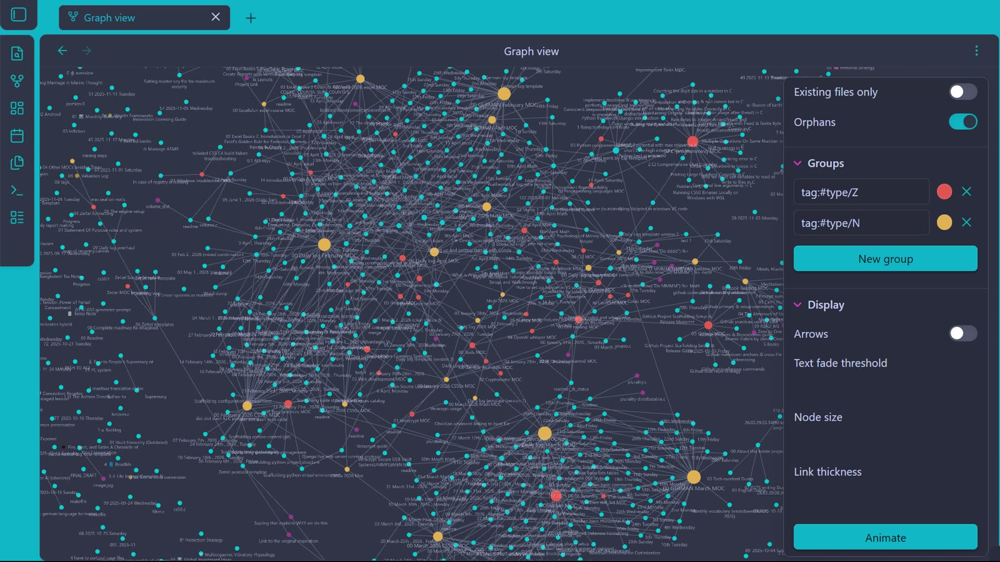

# ☼ Sidratul Al Birun's Learning Log

> "Knowledge is the compound interest of the mind. The goal is to get better by 1% every single day."

Welcome to my **Digital Garden**. This repository is a real-time "Proof of Work" for my journey into Computer, AI&ML, Data Science, and Personal Development. It tracks my progress from a "Systematic Mess" to an "Engineered Workflow."

---

## ∇ Repository Architecture
I use a three-layer system to separate **time**, **theory**, and **execution**.

| Pillar             | Description | Link |
| :---               | :---        | :--- |
| **▦ Logs**        | Daily chronological tracking and consistency logs. | [Explore logs](1_Logs) |
| **◉ Knowledge Vault** | Synthesized theory, mental models, and study notes. | [Enter vault](2_Knowledge_Vault)|
| **✥ Projects & Labs** | Source code, Excel workbooks, and practical evidence. | [View Labs](2_Knowledge_Vault)|
| **❒ Archive**         | Major milestones and completed certifications. | [See Trophies](4_Archive) |

---

## ♧ Current Objectives (April 2026)

### 🟢 The Engine (Core Skills)
- [ ] **CS50x:** Harvard’s Introduction to Computer Science (Currently: Week 4 - Memory).
- [ ] **Linear Algebra:** DeepLearning.AI Mathematics for ML & DS.
- [ ] **MS Excel:** Advanced Data Analysis & Automation (excelisfun).

### 🔵 Human OS (Maintenance)
- [ ] **German (Deutsch):** Reaching A1 proficiency. V2 system deployed(15th Apr)
- [ ] **Reading:** `WIll be updated later`.
- [x] **IELTS:** Target Band 9.0 (**Current: Band 8.0 Achieved** ✅).

---

## 📈 System Evolution & Action Log
This repository is constantly being refactored to improve scalability. For a full technical history of changes, system migrations, and version updates:

➤ **[View the CHANGELOG.md](./CHANGELOG.md)**

---

## ⚙️ Methodology
- **Timezone:** All logs follow **GMT +6 (ISO 8601)**.
- **Naming Conventions:** Strict use of `kebab-case` OR `snake_case` for file integrity.
- **The Atomic Rule:** Since April 14, 2026, all logs are "Atomic" (one file per day) to ensure high resolution and low clutter.

---

"Save money for the sake of saving." — Morgan Housel.